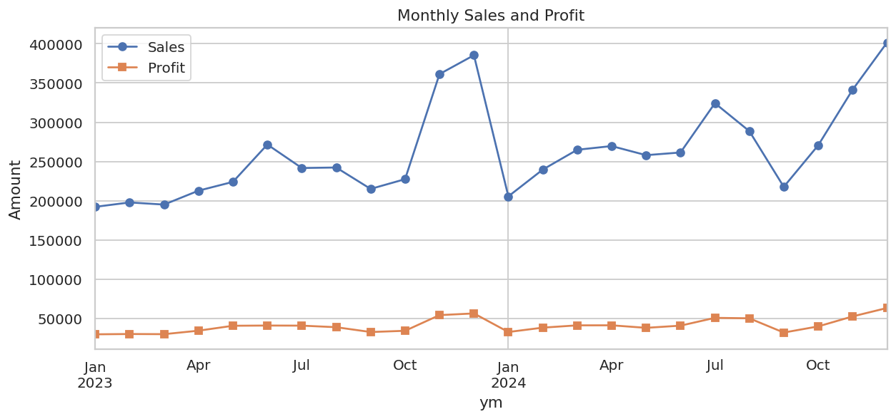
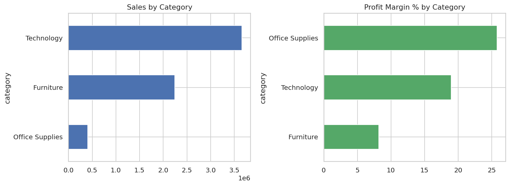
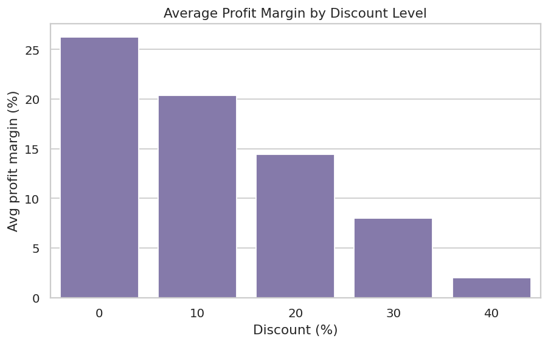
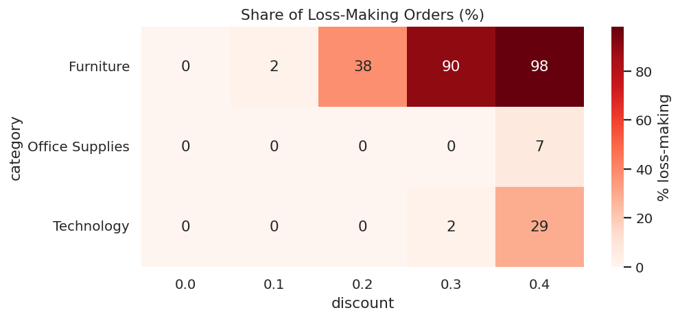
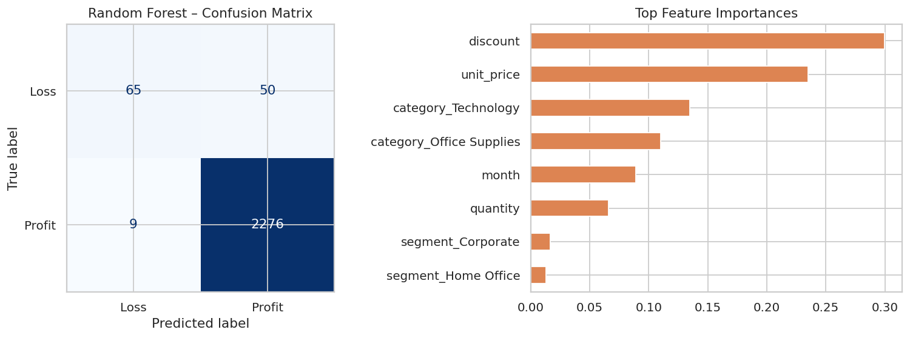

# 🛒 Retail Sales Analysis & Profit Prediction

An end-to-end data science project in the **Retail** domain: data cleaning → exploratory analysis → visualizations → machine-learning prediction → business recommendations.

## 🎯 Objectives
- Understand sales and profit trends over time
- Find which categories, regions and segments drive (or hurt) profit
- Measure the effect of discounting on profitability
- Build a model that predicts whether an order will be **profitable**

## 📦 Dataset
`data/retail_sales.csv` – 12,000 orders (Jan 2023 – Dec 2024) with date, category, product, price, quantity, discount, sales, profit, region, segment and customer ID.

> **Note:** the data is synthetically generated (`generate_data.py`, fixed seed) to mimic real retail patterns, including seasonality, duplicates and missing values. The pipeline works on real data too, e.g. the Kaggle *Superstore* dataset, if columns are renamed to match.

## 🔧 Tech Stack
Python · pandas · NumPy · Matplotlib · Seaborn · scikit-learn

## 🧪 Methodology
1. **Cleaning:** removed 40 duplicate rows, filled 120 missing regions, engineered date features and profit margin.
2. **EDA:** KPIs, monthly trend, category / region / segment analysis, discount impact, correlations.
3. **Modeling:** Logistic Regression and Random Forest to classify orders as profit / loss (80/20 stratified split).

## 📊 Key Findings
| Insight | Result |
|---|---|
| Total sales / profit | ≈ 6.31M / 0.98M (15.6% margin) |
| Growth | Sales up ~12.7% from 2023 to 2024 |
| Seasonality | Dec ≈ 1.5× and Nov ≈ 1.34× the average month; Jan is lowest |
| Discount impact | Margin drops from ~26% (no discount) to ~2% (40% off) |
| Problem category | Furniture: 8.2% margin; ~90% of orders with 30%+ discount lose money |
| Best margin | Office Supplies (25.8%); Technology is the revenue leader |
| Model accuracy | Random Forest ≈ 97.5% (loss-order recall ≈ 57% because losses are rare) |







## ✅ Recommendations
- Cap Furniture discounts at 20% and require approval for discounts ≥ 30%.
- Prepare inventory and staffing ahead of Nov–Dec.
- Bundle high-margin Office Supplies with big-ticket items.
- Investigate the lagging South region.

## ▶️ How to Run
```bash
git clone https://github.com/tanmaywanjari/retail-sales-analysis.git
cd retail-sales-analysis
pip install -r requirements.txt
python generate_data.py        # optional: regenerate the dataset
jupyter notebook retail_sales_analysis.ipynb
```
Or run everything as a script: `python analysis.py`

## 📁 Structure
```
├── data/retail_sales.csv
├── images/                    # saved charts
├── retail_sales_analysis.ipynb
├── analysis.py                # same analysis as a script
├── generate_data.py
├── requirements.txt
└── README.md
```

## 🔮 Future Work
Time-series forecasting (ARIMA/Prophet), customer segmentation (RFM + K-Means), an interactive dashboard (Streamlit / Power BI).
